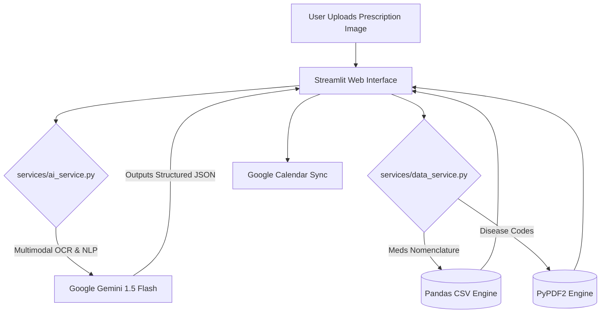

<div align="center">
  <h1>💊 Prescripto</h1>
  <h3>AI-Powered Health Assistant & Prescription Digitizer</h3>
  <p><i>Developed during <strong>AI Hackathon Cluj 2026</strong></i></p>

  <!-- Badges -->
  <p>
    <a href="https://www.python.org/downloads/"></a>
    <a href="https://streamlit.io"></a>
    <a href="https://ai.google.dev/"></a>
    <a href="https://pandas.pydata.org/"></a>
  </p>
</div>

<hr>

## 📖 Table of Contents
- [🎯 The Problem & Vision](#-the-problem--vision)
- [✨ Key Features](#-key-features)
- [🏗️ System Architecture](#️-system-architecture)
- [📂 Project Structure](#-project-structure)
- [⚙️ Installation & Setup](#️-installation--setup)
- [🔮 Future Roadmap](#-future-roadmap)

---

## 🎯 The Problem & Vision

Medical handwriting is notoriously illegible, and the jargon used—such as raw international classification codes or complex active ingredient abbreviations (DCI)—often leaves patients confused. This friction leads to low adherence rates, accidental dosing mistakes, and financial inefficiencies (e.g., missing out on affordable generic alternatives).

**Prescripto** solves this with a multi-layered, interactive system that combines multimodal Large Language Models (LLMs) with traditional deterministic database verification. It doesn't just digitize text; it enforces a **Human-in-the-Loop validation workflow**, translates cold diagnostics into empathetic patient-centric language, checks for generic cost alternatives, and structures data seamlessly for calendar synchronization.

---

## ✨ Key Features

| Feature | Description |
| :--- | :--- |
| **🔍 Multi-Modal Vision Processing** | Translates handwritten notes directly into structured JSON. Extracts commercial names, prescribed dosages (e.g., `500mg`), and frequencies. |
| **🛡️ Human-in-the-Loop Validation** | Pre-populates fields inside interactive Streamlit forms, allowing immediate overrides, corrections, and verified selectbox bindings based on the official DB. |
| **🩺 "Medical-to-Human" Translator** | Converts terrifying medical codes into calm, relatable guidance. <br> *Ex: J06.9 ➡️ "Gâtul tău este inflamat, dar te vei face bine cu odihnă."* |
| **💡 Smart Cost Optimization** | Extracts the active chemical substance (DCI) and searches full-table data to suggest highly affordable alternative generic labels. |
| **📅 Structural Scheduling Pipeline** | Pre-calculates timing vectors (e.g., `["08:00", "20:00"]`) prepped for direct Google Calendar API integration. |

---

## 🏗️ System Architecture

The core architecture follows clean coding practices, separating concerns into individual processing layers:



### 🧠 1. Artificial Intelligence Layer (`ai_service.py`)
* **Engine:** Google Gemini 1.5 Flash (`gemini-flash-latest`) for multi-modal processing.
* **Resilient Parsing:** Features robust handling for JSON formatting artifacts. The system strips away any markdown formatting code fences automatically.
* **Context-Driven Translation:** Implements an empathetic zero-shot prompt.

### 📊 2. Data Access & Nomenclatures Layer (`data_service.py`)
* **Pharmaceutical Nomenclatures (`Pandas`):** Parses large-scale commercial drug catalogs with `on_bad_lines='skip'` to guard against dirty data fields.
* **PDF Registry Scanning (`PyPDF2`):** Reads the national standard disease index registers line-by-line dynamically.

---

## 📂 Project Structure

```bash
prescripto/
├── data/
│   ├── medicamente.csv      # Official dataset for pharmaceutical names & DCI
│   └── coduri_boala.pdf     # National disease catalog containing standard diagnostic indexes
├── services/
│   ├── ai_service.py        # Gemini config, multimodal bindings, prompt engineering
│   └── data_service.py      # Pandas & PyPDF2 indexing lookup logic
├── utils/
│   └── config.py            # Environment credentials parsing (GEMINI_API_KEY)
├── main.py                  # Streamlit layouts, UI routing, verification pipelines
└── README.md                # You are here
```

---

## ⚙️ Installation & Setup

### Prerequisites
* Python **3.9+** installed.
* A valid **Google Gemini API Key** from [Google AI Studio](https://aistudio.google.com/).

### 1. Clone the Repository
```bash
git clone https://github.com/your-username/prescripto.git
cd prescripto
```

### 2. Configure Virtual Environment
```bash
# Create a virtual environment
python -m venv venv

# Activate on Linux / macOS:
source venv/bin/activate
# Activate on Windows:
venv\Scripts ctivate
```

### 3. Setup Environment Configurations
Create a `utils/config.py` file to store your credentials:
```python
# utils/config.py
GEMINI_API_KEY = "YOUR_ACTUAL_GEMINI_API_KEY_HERE"
```

### 4. Launch the Application
Start the interactive local Streamlit dashboard:
```bash
streamlit run main.py
```
Open your browser and navigate to `http://localhost:8501`.

---

## 🔮 Future Roadmap
- [ ] **Google Calendar Sync:** Full OAuth2 integration to push scheduling arrays to the user's calendar.
- [ ] **Multi-Page Scanning:** Implement document pagination loops for long reports.
- [ ] **Mobile Camera Integration:** HTML5 native camera widgets inside the browser.

<div align="center">
  <p><i>Made with ❤️ for AI Hackathon Cluj 2026</i></p>
</div>
